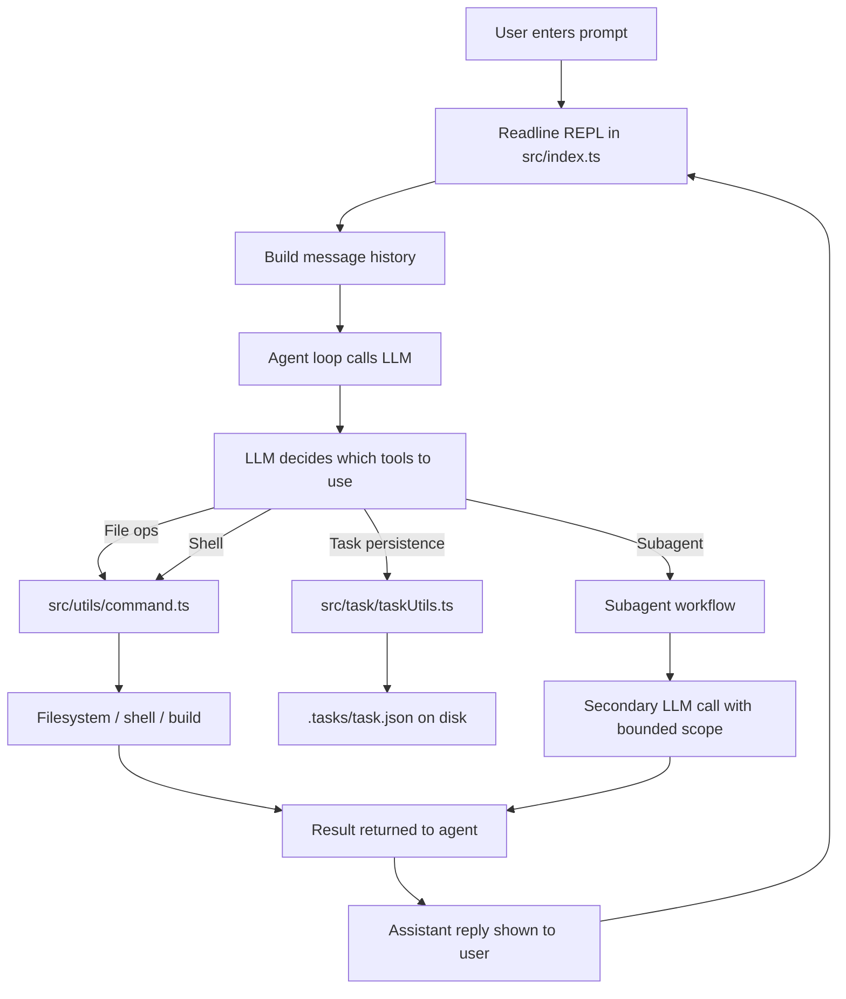

# Terminal Agent CLI

A terminal-based AI agent built with the AI SDK that allows users to interact with their filesystem and execute commands using natural language. Now available as an easy-to-install npm package!

## A Working Demo

https://github.com/user-attachments/assets/7e408ffb-d492-4ccb-b28d-7293404d2736


## 🚀 Quick Start (Global Installation)

The easiest way to use Terminal Agent is to install it globally via npm:

```bash
npm install -g @rayyanalam047/terminal-agent-cli@2.0.3
```

Once installed, you can run it from anywhere in your terminal:

```bash
terminal-agent
```

## 🔑 API Key Setup

Before using the agent, you need to set up your OpenAI API key. The agent includes a built-in command for this:

1. Start the agent:
   ```bash
   terminal-agent
   ```

2. Set your API key using the `/setkey` command:
   ```
   >>>INPUT : /setkey sk-your-openai-api-key-here
   ```

   Alternatively, you can be prompted for it:
   ```
   >>>INPUT : /setkey
   Enter your OpenAI API key: sk-your-openai-api-key-here
   ```

Your API key will be securely saved and used for all subsequent sessions.

## 📦 Local Installation (Development)

If you prefer to run from source or contribute to the project:

1. Clone the repository:
   ```bash
   git clone https://github.com/Rayyan-Alam71/CLI_based_agent.git
   cd terminal-agent
   ```

2. Install dependencies:
   ```bash
   npm install
   ```

3. Build the project:
   ```bash
   npm run build
   ```

4. Set up your API key as described above, then run:
   ```bash
   npm start
   ```

   Or directly:
   ```bash
   node dist/index.js
   ```

## 🎯 Features

- Natural language interface for file operations (read, write, edit)
- Ability to run bash commands
- Subagent delegation for complex tasks
- Persistent task tracking with write/read/edit task tools
- Task state saved to `.tasks/task.json` for multi-step workflows
- Interactive REPL loop with beautiful TUI (Terminal User Interface)
- Built-in API key management via `/setkey` command
- Color-coded boxes for clear visual separation of user input, tool calls, and agent responses
- Todo management capabilities
- Built with TypeScript and the AI SDK

## 🏗️ Architecture



## 🖥️ Terminal User Interface

The agent features a rich TUI with:
- **Welcome banner** when starting
- **Colored input prompts** (green bold)
- **Thinking spinner** while processing
- **Boxed sections** for:
  - User input (green border)
  - Tool calls/results (yellow border)
  - Agent responses (blue border)
- **Persistent todo list** display (yellow)
- **Visual status indicators** for todos (green check, blue in-progress, red fail)

## 💡 Usage Examples

After starting the agent and setting your API key, you can interact with it using natural language:

```
>>>INPUT : Read the file `src/index.ts`
>>>INPUT : Write a file `hello.txt` with content 'Hello World'
>>>INPUT : List the files in the current directory
>>>INPUT : Run the command `ls -la`
>>>INPUT : Create a subagent to summarize the contents of the src directory
>>>INPUT : Create a persistent task list for implementing a new feature
>>>INPUT : Read the current tasks
>>>INPUT : Update the status of task 1 to in_progress
```

Special commands:
- `exit` - Quit the application
- `help` - Show help information
- `/setkey <api_key>` - Set your OpenAI API key

## 🏗️ Project Structure

```
terminal-agent/
├── src/
│   ├── index.ts          # Main agent loop and REPL interface
│   ├── task/
│   │   ├── taskUtils.ts  # Task persistence helpers for read/write/edit task operations
│   │   └── types.ts      # Task-related TypeScript types
│   └── utils/
│       ├── command.ts    # Tool implementations (bash, file operations, subagents)
│       ├── model.ts      # AI model configuration
│       ├── prompt.ts     # System prompts for the agent and subagents
│       └── tools.ts      # Tool definitions for the AI SDK
├── docs/
│   └── utils-overview.md # Detailed documentation of utility modules
├── .tasks/
│   └── task.json         # Persisted task state created by the agent
├── node_modules/
├── package.json
├── tsconfig.json
└── README.md
```

## 🔧 How It Works

The agent uses a sophisticated loop that:

1. Reads user input from the terminal
2. Sends the input (along with conversation history) to an AI language model
3. The model decides which tools to use based on the available tools defined in `src/utils/tools.ts`
4. The agent executes the selected tools (file operations, bash commands, subagent creation)
5. For long-running or multi-step work, it can persist task state using the task tools and store it in `.tasks/task.json`
6. The results are fed back to the model for further reasoning or to produce a final answer
7. The conversation history is maintained to allow for contextual interactions

## 🛠️ Tools Available

The agent provides the following tools to the underlying AI model:

- `bash`: Execute bash commands
- `read_file`: Read the contents of a file
- `write_file`: Write content to a file (creates if doesn't exist, overwrites otherwise)
- `edit_file`: Edit an existing file by replacing a specific string
- `build_project`: Build the project to check for TypeScript or compile errors
- `update_todos`: Manage an in-memory todo list for complex multi-step work
- `write_task`: Create or replace the persisted task list in `.tasks/task.json`
- `read_task`: Read the persisted task list from `.tasks/task.json`
- `edit_task`: Update an existing task entry incrementally as work progresses
- `subAgent`: Delegate a task to a subagent for complex operations

## 📋 Task Persistence

For multi-step tasks, the agent can persist a task record between turns. The workflow is:

1. Use `read_task` to inspect the current task list
2. Use `edit_task` to update existing tasks as progress changes
3. Use `write_task` when creating a fresh task snapshot or replacing the full task list

Task data is stored in `.tasks/task.json`, which makes it easier to resume long-running work without losing context.

## 📚 Documentation

Detailed documentation of the utility modules is available in the `/docs` directory:
- [Utils Module Overview](docs/utils-overview.md) - Comprehensive guide to the utility modules (`command.ts`, `model.ts`, `prompt.ts`, `tools.ts`)

## ⚙️ Configuration Details

### Model Configuration (`src/utils/model.ts`)

The model is currently configured to use OpenAI's GPT-4 model via the AI SDK. You can modify this to use other providers supported by the AI SDK.

### System Prompts (`src/utils/prompt.ts`)

- `getRootSystemPrompt()`: Defines the behavior of the main agent
- `getSubagentSystemPrompt()`: Defines the behavior of subagents

## 👨‍💻 Development

To modify the agent and rebuild:

1. Make changes to the TypeScript source in the `src/` directory
2. Run `npm run build` to compile to JavaScript in the `dist/` directory
3. Run the agent as described in the Usage section

## 📦 Dependencies

- `ai`: The AI SDK for building AI-powered applications
- `@ai-sdk/openai`: OpenAI provider for the AI SDK
- `dotenv`: For loading environment variables
- `zod`: For schema validation (used with the AI SDK)
- `chalk`: For terminal string styling
- `ora`: For elegant terminal spinners
- `boxen`: For creating boxes in the terminal
- `@types/node`: TypeScript definitions for Node.js (dev dependency)

## 📄 License

ISC

## 🙏 Acknowledgments

- Built with the [AI SDK](https://sdk.vercel.ai/docs)
- Inspired by the Claude Code CLI and similar agent frameworks
